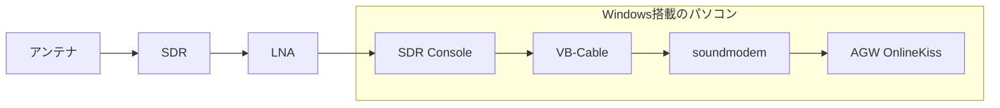
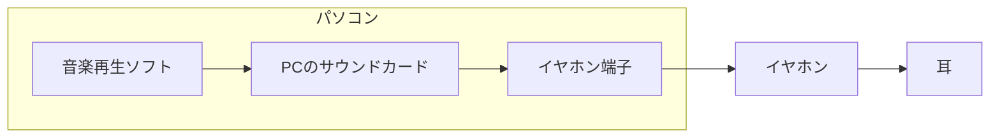
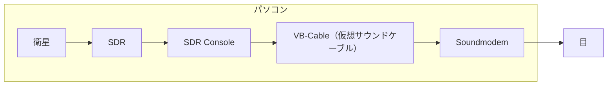

:::message
本記事は過去に執筆した[「ソフトウェアTNC を Windows 11 に導入する」](https://zenn.dev/k42uma/articles/software-tnc-windows)という記事をブラッシュアップしたものであり、衛星からのパス取得に向けた一連の流れを説明します。
:::

## はじめに
本記事はアマチュア無線帯を使用した人工衛星（主にCubeSat）からのパスを取得する一連の流れを説明するための記事です。主に、初学者の方向けにソフトウェアのダウンロードや使い方を説明するために執筆しております。

筆者も初学者であり、衛星からのパス取得の経験はかなり浅いため、アドバイスや修正はコメントや[Twitter](https://x.com/k42uma)にてお願いいたします。（所属団体の新入生教育で急遽必要になったため、記事にしました。）また、リンクの二次共有も大歓迎ですので、シェアしていただけますと幸いです。

なお、アンテナの選定や設置、制御といった部分は記事に含んでおりませんので、ご自身でお調べいただくよう、お願いします。ご要望が多ければ、記事にするかもしれませんが...。

## 概要
:::message alert
PCは原則として最新のWindowsを使用することをおすすめします。。MacやLinuxを使用することも可能ですが、筆者は対応ソフトウェアの少なさやコミュニティの不足などを鑑みて、Windows 11のパソコンを使用しております。本記事もWindowsユーザ向けのものになっておりますので、ご了承ください。
:::

まず、本記事で説明するパスを取得するためのハードウェアやソフトウェアの構成を説明します。なお、以下に示す構成はあくまでも一例に過ぎず、他のソフトウェアやハードウェア等で大体することも可能ですが、今後の説明には以下の構成を使用します。



以下ではコンポーネントをそれぞれ軽く説明します。

### アンテナ
電磁波を電気エネルギーに効率よく変換するための機器です。皆さんがよくご存知のテレビアンテナももちろんアンテナの一種です。とてもわかりやすく説明すると、『衛星からの電波をめっちゃ集める機器』と表現できるでしょう。

なお、筆者は15エレメントの八木アンテナを使用し、衛星のパスを受信しています。また、Twitterを見ているとQFHアンテナ（円偏波無指向性アンテナ）やハンディ用のヘリカルアンテナ（円形のループアンテナ）を使用している人もよく見かけます。


*アンテナの一例*

### SDR
SDRはSoftware Defined Radioの略で、ハードウェアの変更なしに様々な方式の通信に対応することができる無線機です。ミキサーやアンプ、スイッチ、フィルタといったコンポーネントによって構成されており、幅広い周波数帯の様々な変調方式の電波を受信することが可能となっております。

衛星通信においては、SDRがアンテナで受け取った電波を可聴波に変換することで、アマチュア無線帯の電波を人間が聞くことができる電波に変換してくれます。

そこそこ使えるSDRがAmazonでは5,000円程度で販売されております。（なんとも良心的!!）
一般的によく使われており、筆者も利用しているSDRのAmazon購入リンクを一応貼っておきます。
https://amzn.to/4onxgQk

### LNA
LNAはLow Noise Amplifierの略で、微弱な電波を雑音の発生が少ない環境でで増幅するための機器です。LEO衛星ですと地球局との距離は$400[\mathrm{km}]$程度あり、その遠さが故に地球での受信強度はかなり小さくなってしまいます。

私の環境ではLNAをあまり利用していないので、詳細は省略します。


### SDR Console

SDR Consoleは先述のSDRを操作するためのソフトウェアです。SDR Consoleでは受信する周波数の設定やアンプの調整、変調方式の変更、受信データの可視化などを行うことが出来ます。要するに、**SDRを操作してくれる、超便利なソフトウェア**ということです。

こういったソフトウェアは世の中に五万とあるのですが、その中でもSDR Consoleを選んだ理由としては 「**衛星からのパス受信に特化した機能が複数存在する**」という点です。衛星のトラッキングやドップラーシフトの調整、パスの管理といった衛星からのパスを受信する上で必要な機能がほとんど盛り込まれています！！！（本来は複数のソフトウェアでやるべきことを一つのソフトで完結させることが可能です。）

便利な反面、設定項目が多く、取っ付きづらいという一面もありますが、慣れれば不自由なく衛星のパスを受信することが出来ます。ただSDRで適当に受信したいだけの時は、SDR Sharpを用いる方が楽かなと思っています。

### VB-Cable

VB-CableはSDR ConsoleとSoundmodemを接続するための仮想サウンドケーブルです。SDR Consoleで可聴波に変換されたデータを、ソフトウェアTNCであるSoundmodemに届ける役割を果たしてくれます。

とは言っても分かりづらいと思うので、簡単に説明しておくと、皆さんがパソコンでイヤホンを用いて音楽を聞く際はこういった流れになっていると思います。



しかし、SDRを用いて、衛星のパスを受信する際は、PCから放出されるはずだったサウンドを再度マイクに入力することで、音声からの復調を行う必要があります。そこで、VB-Cableの出番が訪れます。



要するにVB-CableはSDRで取得した音をスピーカーから出すのではなく、パソコン内で利用するために使用します。 

### soundmodem

### AGW OnlineKiss

## ソフトウェアのダウンロード
### Zadig
USBデバイスへアクセスするための汎用的なドライバをダウンロードするためのソフトウェアです。

以下のリンクより、Zadigのダウンロードページにアクセスしてください。

https://zadig.akeo.ie/

Downloadの欄より、Zadig x.x（執筆時点ではZadig 2.9）をクリックすることでダウンロードすることができます。ダウンロード後はドキュメント等の分かりやすい位置に配置しておいてください。

### SDR Console
以下のリンクより、SDR Consoleのダウンロードページにアクセスしてください。

https://www.sdr-radio.com/download

サイト下部のDownloadの欄より、64bit MicrosoftをクリックするとOneDriveのページに飛ぶので、そちらからセットアップファイルをダウンロードすることが出来ます。そちらを実行することで、WindowsにSDR Consoleがダウンロードされます。


*SDR Consoleのダウンロードページ*


*OneDriveからのダウンロード*

## VB-Cable
以下のリンクより、VB-Cableのダウンロードページにアクセスしてください。

https://vb-audio.com/Cable/

Windowsマークのダウンロードボタンをクリックすることで、セットアップファイルの入ったZIPファイルをダウンロードすることができます。そして、ZIPファイルを解凍し、VBCABLE_Setup_x64.exeを実行すると以下の画面が表示されます。


*VB-Cableのインストローラ*

そこで、Install Driverを押し、システムダイアログの指示にしたがって操作することでVB Cableをダウンロードすることが出来ます。サウンドの欄にサウンドカードが追加されていることが確認できるかと思います。

### soundmodem

以下のリンクの公式ホームページから直接ダウンロードすることができます。

https://uz7.ho.ua/packetradio.htm

この後は受信したいパスの変調方式によって、ダウンロードするソフトウェアが異なります。
主に、`AFSK`や`PSK`を受信したい場合は通常のSoundmodemを、`GMSK`などを受信したい場合はHigh-Speed Soundmodemを使用してください。


*Soundmodemシリーズが対応している変調方式*

Soundmodemは`soundmodem114.zip`というリンク、High-Speed Soundmodemは`hs_soundmodem27.zip`というリンクを踏むことで、ダウンロードできます。（番号はバージョンによって変更されている可能性があります。）ダウンロード後は解凍し、ドキュメントなどの分かりやすい位置に配置してあげてください。

筆者が試したところ、Google Chrome ではリンクを踏んでも一向にダウンロードできなかったため、同様の症状に遭遇した場合は Microsoft Edge などの別のブラウザを使用してみてください。

### AGW OnlineKiss
#### 必要なランタイムのダウンロード
AGW OnlineKISS を使用する上で、Visual Basic 6.0 のランタイムが必要となる。Microsoft 公式からの配布は確認できなかったため、筆者は Vector よりインストーラを入手した。

https://www.vector.co.jp/soft/win95/util/se342080.html

インストーラを使用して、ダウンロードすることで環境がぐちゃぐちゃになることが怖かったので、インストーラを解凍して手動でインストールすることとした。以下の手順を踏むことでインストールが可能である。

1. `VB6RTSP6Maximum.exe` を 7-Zip などで解凍する
2. `Setup.exe` を同様に解凍する
3. 内部に存在する以下のファイルを、`C:\Windows\SysWOW64` へコピーする
    ```
     ・ MSCOMM32.OCX
     ・ COMDLG32.OCX
     ・ RICHTX32.OCX
     ・ MSWINSCK.OCX
    ```
4. コマンドプロンプトを管理者権限で開き、以下のコマンドを実行する
    ```
    cd C:\Windows\SysWOW64
    regsvr32 MSCOMM32.OCX
    regsvr32 COMDLG32.OCX
    regsvr32 RICHTX32.OCX
    regsvr32 MSWINSCK.OCX
    ```

#### AGW OnlineKISS のインストール
以下のリンクの公式ホームページから直接ダウンロードすることができます。

https://www.satblog.info/software/

`AGW OnlineKISS plus`というリンクを踏むことでダウンロードできます。（`AGW`などで検索すると簡単に見つけることが出来ます。）ダウンロード後は解凍し、ドキュメントなどの分かりやすい位置に配置してあげてください。

#### ini ファイルの設定
`agw_online_kiss` フォルダの中に、`agw_onlinekiss.ini` というファイルが存在します。これを適切に書き換えてあげる必要があります。また、同時に`agw_online_kiss_plus.exe` と同じ階層に `logfiles` というフォルダを作成してください。

```diff
- FILE_PATH = D:\Amateurfunk
+ FILE_PATH = ./logfiles

- CALLSIGN = DK3WN
+ CALLSIGN = <自身のコールサイン>

- QTH_LAT = 49.73145
- QTH_LONG = 8.95564
- QTH_HEIGHT = 0.28
+ QTH_LAT = <自身の地上局の緯度>
+ QTH_LONG = <自身の地上局の経度>
+ QTH_HEIGHT = <自身の地上局の高さ（km）>

- TLEFILE = D:\Amateurfunk\Orbitron\TLE\amateur.txt
+ TLEFILE = ./TLE.txt
```

緯度・経度は Google Maps 上で右クリックすることで調べることができます。（使わないので、適当でも全く問題ありません。）

#### TLE ファイルの設定
AGW OnlineKiss において、TLEが必要になる場面がいまいちわからなかったのでひとまず筆者はISSのTLEを追加しました。

まず、`agw_online_kiss_plus.exe` と同じ階層に、`TLE.txt` を作成し、以下の内容をコピーしてください。もし、AGW OnlineKiss の機能をフルに活かしたい場合は自身で対象の衛星の最新のTLEを調べて、コピペしてください。この際、`(` などの記号が `TLE.txt` に含まれているとエラーが発生してしまうため、含めないようにしましょう。

```
ISS
1 25544U 98067A   25268.88924235  .00024001  00000-0  42185-3 0  9994
2 25544  51.6319 167.9312 0003311   8.6325 351.4720 15.50358116530788
```

対象となる衛星のTLEを複数登録することで衛星ごとにログファイルを分類することができるので、AGW OnlineKISS　で衛星追跡を行わない人でもインデックスの登録は済ませておくと良いでしょう。

なお、もし適当な衛星を追加した場合は、AGW Online Kissを使用するときに`filter packets if elev<0`に関しては**チェックを外すよう**にしましょう。これは、設定した衛星の仰角が0度より小さい時（つまり、衛星とパスが取れない時）はデコードを行わないという便利機能なんですが、今回は適当な衛星（ISSなど）を追加したため、機能を使用することは出来ません。

## ソフトウェアの使い方

## パスを受信するまでの流れ