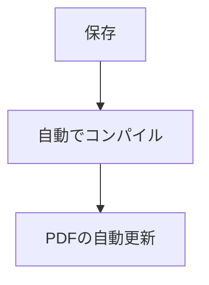

## はじめに
これまでレポートや資料を書くときは、もっぱら Cloud LaTeX に頼りきりでした。ブラウザだけで完結して、環境構築の手間がまるごと省けるので、面倒くさがりの自分にはありがたい限りと感じていました。

ただ、しばらく使っているうちに「電波の届かない場所でも書けたら」「ローカルでもう少しテンポよくコンパイルできたら」といった不満がちらほら出てきました。そんなわけで、今回は思い切ってローカルに LuaLaTeX での日本語執筆環境を整えてみたので、その記録を残しておこうと思います。

「そろそろCloud LaTeXを卒業して、手元に環境を持っておきたいな」と考えている方の手助けになれば嬉しいです。

ちなみに、正直CloudLaTeXを使う方が便利な場面も多々存在するので、まずはCloud LaTeXから...といった人は以下の記事を読んでみてください。
https://zenn.dev/k42uma/articles/latex-beginner

## 環境
本記事の作業を行った環境は以下の通りです。

| 項目 | 内容 |
| :----: | :----: |
| PC   | Macbook Air (M3, 2024) |
| OS   | macOS 15.7.4|
| エディタ | VSCode |
| TeX 環境 | MacTeX |
| 拡張機能 | LaTeX Workshop |
| エンジン | LuaLaTeX（`ltjsarticle`） |

今回は Mac で作業したため、内容も Mac ユーザを想定したものになっています。Windows でも近い構成は組めるはずなので、そちらの需要があれば改めて取り上げるかもしれません。

:::message
今回は Homebrew が導入済みであることを前提に進めます。未導入の方は『Mac Homebrew インストール』あたりで検索すると丁寧な記事がたくさん出てくるので、先にそちらを済ませておいてください。
:::

## 手順

### 1. MacTeX のインストール
はじめに、Homebrew で MacTeX を入れていきます。

```bash
brew install --cask mactex
```

途中では「インストールしますか？」と聞かれたり、「パスワードを入力してください」と求められたりするので、適宜対応しましょう。

インストールが終わると、こんな感じのメッセージが出てきます。

```text
🍺  mactex was successfully installed!
```

### 2. TeX コマンドの確認
MacTeX へのパスを反映させるため、ターミナルを再起動してください。そのうえで、各コマンドが認識されているかを確認します。

```bash
which lualatex
which latexmk
```

問題なければ、次のようにパスが返ってくるはずです。

```text
/Library/TeX/texbin/lualatex
/Library/TeX/texbin/latexmk
```

### 3. LuaLaTeX の動作確認
ここまで準備できたら、コンパイルが通るかを試しておきましょう。まずは最小構成の TeX ファイルを用意します。

```latex
\documentclass{ltjsarticle}

\begin{document}
こんにちは
\end{document}
```

用意したファイルを、次のコマンドでコンパイルします。

```bash
latexmk -lualatex test.tex
```

PDF が出力されていれば、ひとまずここまでは成功です。

### 4. VSCode に LaTeX Workshop を導入
次に、執筆を快適にしてくれるVSCodeの拡張機能を入れます。VSCode の拡張機能タブで、以下を探してインストールしてください。

- **LaTeX Workshop**

LaTeX 執筆では鉄板の拡張機能で、保存時の自動コンパイルから PDF プレビューまで、この一つでほぼまかなえてしまいます。

### 5. VSCode の設定
LuaLaTeX を使うように設定を整えます。

「Cmd + Shift + P」を押して、`Preferences: Open User Settings (JSON)` を開き、以下を追記してください。

```json
{
  "latex-workshop.latex.tools": [
    {
      "name": "latexmk",
      "command": "/Library/TeX/texbin/latexmk",
      "args": [
        "-lualatex",
        "-synctex=1",
        "-interaction=nonstopmode",
        "-file-line-error",
        "-outdir=%OUTDIR%",
        "%DOC%"
      ]
    }
  ],

  "latex-workshop.latex.recipes": [
    {
      "name": "latexmk (LuaLaTeX)",
      "tools": ["latexmk"]
    }
  ],

  "latex-workshop.latex.autoBuild.run": "onSave",

  "latex-workshop.view.pdf.viewer": "tab",

  "latex-workshop.synctex.afterBuild.enabled": true
}
```

ざっくり言えば、**「保存をトリガーに、latexmk が LuaLaTeX でビルドしてくれる」** ように指示する内容となっています。


:::message
拡張機能の構成によっては、`LaTeX Workshop is incompatible with vscode-pdf` という警告が出ることがあります。これは `vscode-pdf` と `LaTeX Workshop` がどちらも PDF ビューア機能を持っているために出るもので、特に問題はありません。気になる場合は `vscode-pdf` を無効化しておけば警告も消えます。
:::

## さいごに
本記事では、Mac 上に VSCode + MacTeX + LaTeX Workshop を組み合わせ、LuaLaTeX で執筆できる環境を整える流れをまとめました。

これで、




という、Cloud LaTeX に近いリズムでの執筆をローカルでも回せるようになります。

オフラインで書く意味はあんまりわからないというのが、現在の正直な気持ちですが、ローカルでもきちんと環境を持っておくに越したことはないかと思います。同じところでつまずいている方の参考になれば幸いですし、気になる点や誤りがあれば、コメントなどで気軽に指摘していただけると助かります。
